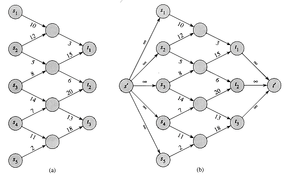

# Miami Traffic Prediciton and Evacuation

#### Contributors:
- Stephen Tse
- [Marguerite Siboni:](https://github.com/msiboni88)
- [Kevin Roesch:](https://github.com/kevincroesch)
- [Eli Regen:](https://github.com/eregen)

### Problems Statement:

In the event of a natural disaster capable of causing massive property damage and loss, evacuating people to areas of safety becomes the top priority. Miami, Florida is a city that is routinely plagued by hurricanes, with Hurricane Florence occurring less than a year ago. While modern GPS is practical and effictive it fails on two fronts during a disaster. Firstly, many systems don't use real-time data to update their maps. For day to day predictions this isn't much of a problem as rush hour occurs at about the same time everyday, but when sudden changes in road conditions can have an enormous difference in people's livelihoods a constantly updating evacution plan is needed.

By leveraging social media, specifically twitter, we hope to model road closures and complications as they happen and create a plan for the Florida government to act on in case of emergency; one that can adjust as needed to changing situations.

### Data Collection

Due to limitations in the Twitter API, only allowing for tweets from a one week timeframe to be gathered, we used a package called <b>GetOldTweets3</b> which allowed us to gather tweets from select news and traffic reporting twitter pages over the past year. An alternative approach that we undertook was collecting as many tweets as possible over the one week allowed window, regardless of source, and tried using those as well. The first method produced more usable observations, whereas the second produced more information per observation.

The second method proved to be more reliable and as the traffic data was more recent we were able to determine road closures easily so in the end we focused on the one week prior to data collection when modeling. 

The most frequently used words from each method are shown in the word clouds below: 

We were able to distill this data down to a DataFrame for modeling with the following **data dictionary**: 

|Feature|Type|Dataset|Description|
|---|---|---|---|
|date|Object (datetime)|model_data|Time of tweet (EDT), formatted yyyy-mm-dd hh:00:00+00:00; covers time span of hh:00 to hh:59|
|tweets|Object (string)|model_data|Concatenation of all tweets pulled in that hour.|
|1-95 North|int|model_data|Staus of major roadway in direction indicated (0 = no lane closures or incidents for duration of hour, 1 = any type of lane closure or incident during hour duration)|  
|1-95 South|int|model_data|Staus of major roadway in direction indicated (0 = no lane closures or incidents for duration of hour, 1 = any type of lane closure or incident during hour duration)|  
|95 Express North|int|model_data|Staus of major roadway in direction indicated (0 = no lane closures or incidents for duration of hour, 1 = any type of lane closure or incident during hour duration)|  
|95 Express South|int|model_data|Staus of major roadway in direction indicated (0 = no lane closures or incidents for duration of hour, 1 = any type of lane closure or incident during hour duration)| 
|I-195 East|int|model_data|Staus of major roadway in direction indicated (0 = no lane closures or incidents for duration of hour, 1 = any type of lane closure or incident during hour duration)|  
|I-195 West|int|model_data|Staus of major roadway in direction indicated (0 = no lane closures or incidents for duration of hour, 1 = any type of lane closure or incident during hour duration)| 
|SR 826 North|int|model_data|Staus of major roadway in direction indicated (0 = no lane closures or incidents for duration of hour, 1 = any type of lane closure or incident during hour duration)|  
|SR 826 South|int|model_data|Staus of major roadway in direction indicated (0 = no lane closures or incidents for duration of hour, 1 = any type of lane closure or incident during hour duration)| 
|US-1 North|int|model_data|Staus of major roadway in direction indicated (0 = no lane closures or incidents for duration of hour, 1 = any type of lane closure or incident during hour duration)|  
|US-1 South|int|model_data|Staus of major roadway in direction indicated (0 = no lane closures or incidents for duration of hour, 1 = any type of lane closure or incident during hour duration)| 

### Modeling

Model hyperparameters were tuned based on performance of tweets predicting I-95 North traffic. Those hyperparameters were then used to build a model for each of the 12 roadway directions being investigated.

When modeling based on all tweets in an hour, an <b>SVC model</b> of <b>TFIDF Vectorized</b> words gave the best results. This model had the following parameters: 
~~~~
tfidf = TfidfVectorizer(
        token_pattern='[a-zA-z]+ | [A-Za-z]+\-*\d+\W(?:[sS]outh|[Nn]orth|East|West|[NSEW]{1,2}|[nswe]{1,2})*',
        stop_words='english',
        max_features=2000,
        min_df=1,
        max_df=.6,
        ngram_range=(2,5)
)
svc = SVC(kernel='poly', gamma=550, C=0.004, degree=1)
~~~~
When modeling based on tweets from news sites only in an hour, a <b>Random Forest model</b> of <b>TFIDF Vectorized </b>words gave the best results. This model had the following parameters: 
~~~~
cvec = TfidfVectorizer(
        token_pattern='[a-zA-z]+ | [A-Za-z]+\-*\d+\W(?:[sS]outh|[Nn]orth|East|West|[NSEW]{1,2}|[nswe]{1,2})*',
        stop_words='english',
        max_features=1700,
        min_df=1,
        max_df=.3,
        ngram_range=(4,8)
)
svc = SVC(kernel='poly', gamma=10, C=0.001, degree=0)
~~~~
##### Model performance: 

We found that models tuned for one direction of a road also performed well on the opposite direction of that road. However, tuning parameters of a model to one road does not appear to give the highest performing models for other roads. It would be possible to improve model performance by adjusting the parameters for each road (or having different parameters for highways versus major roadways). 

We opted not to tune the model parameters to each road in order to improve scalability. 

The ROC curves from each method for our largest accuracy improvement (purple) and our smallest accuracy improvement (blue) from the baseline are shown below: 

### Application

As mentioned previously, the intention of this project is to optimize evacution strategy. The model itself already has applications in optimizing routing, say from a starting point to a destination, but when a large population is try to move in the same general direction something more complex is required to prevent even more traffic problems from arising. 

##### Formulation as an Instance of the Maximum Flow Problem:

We recommend applying our model's real-time road predictive abilities to a formulation of the <b>Maximum Flow problem</b> and solving as a linear program to get directions for groups in different starting areas. As road conditions change these instructions can be quickly updated due to the model using live social media data and the computational efficiency of Simplex. The weighting of the edges should be some function of the road's capacity and speed limit.
    

##### Reducing Computation Time:

To formulate properly set safe areas as sinks, interchanges, ramps, and intersections as nodes, and populated areas as soures. Connnect sinks to a <b>super-sink</b> and sources to a <b>super-source</b> and you can maximize traffic flow during evacuation like any other instance of the Maximum Flow Problem in AMPL. 
    

